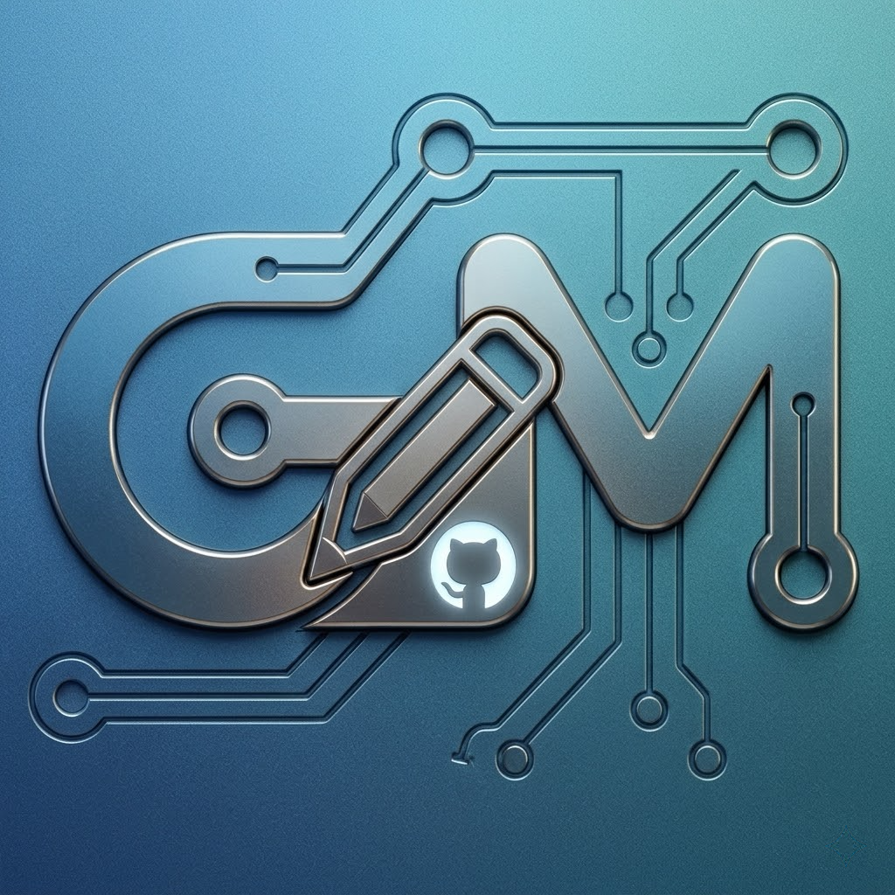
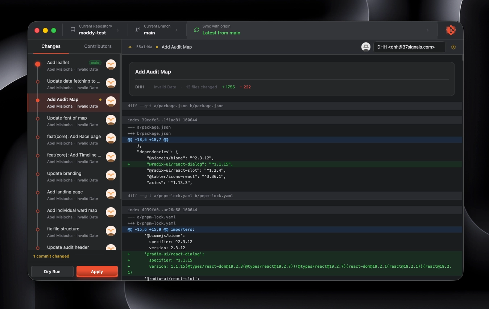

<p align="center">
  
</p>

<h1 align="center">GitModdy</h1>

<p align="center">
  <strong>A sleek, high-fidelity desktop Git history editor built with Wails v3 and React.</strong>
</p>

<p align="center">
  
</p>

---

## 📖 About the Project

**GitModdy** is a desktop Git tool designed to help you edit your local repository's history with ease and speed. Powered by the robust performance of `git-filter-repo`, it allows you to rewrite commit messages, change authors' names and emails, and modify commit dates safely.

### 🌟 Key Features

*   **Interactive Commit History Tree**: Browse through your repository's commits sequentially in a clean, visual log.
*   **Author & Committer Rewriting**: Change names and emails for specific commits or map contributor identities.
*   **Commit Metadata Editing**: Rewrite commit titles, descriptions, and dates.
*   **Safety Guards & Dry Run**: Preview your modified history changes side-by-side with the original history before applying the rewrite.
*   **Platform Installation Checks**: Automatically detects if `git-filter-repo` is installed and guides you with specific instructions for macOS, Windows, and Linux.
*   **Sleek Dark Theme**: Elegant GitHub Desktop-style dark interface optimized for development workflow.

---

## 🚀 Download Releases

Pre-compiled production binaries for all major desktop platforms are available on the [Releases Page](https://github.com/0necontroller/gitmoddy/releases):

*   🍏 **macOS** (Intel / Apple Silicon compat)
*   🪟 **Windows** (x64)
*   🐧 **Linux** (Ubuntu / Debian compat)

---

## 🛠️ Run & Build Instructions

### Prerequisites

To run or build GitModdy from source, you will need the following tools:

1.  **Go** (1.21+)
2.  **Node.js** & **pnpm** (or npm/yarn)
3.  **Wails v3 CLI**
4.  **git-filter-repo** (Required for rewriting commits):
    *   **macOS**: `brew install git-filter-repo`
    *   **Windows**: `pip install git-filter-repo`
    *   **Linux**: `sudo apt install git-filter-repo`

### Development

Start the development server with live-reloading:

```bash
wails3 dev
```

### Production Build

Compile a production binary for your current operating system:

```bash
wails3 build
```

This generates a ready-to-run executable in the `bin/` directory.

### Running Backend Tests

You can verify the backend functionality using standard Go testing:

```bash
go test -v ./...
```

---

## 📜 License

Distributed under the MIT License.
